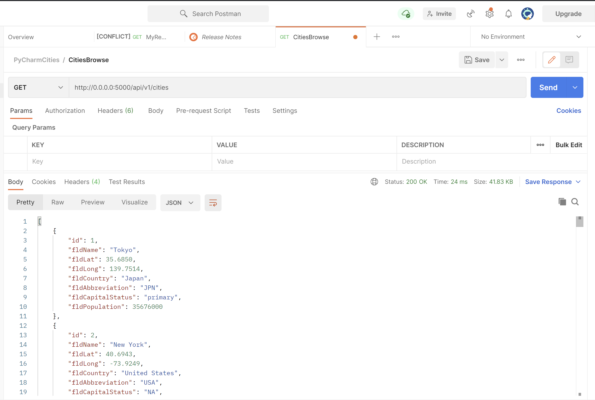
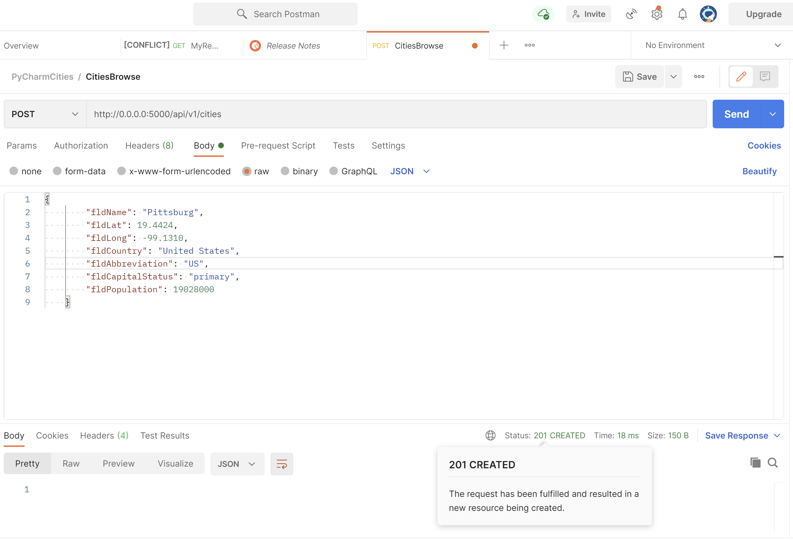
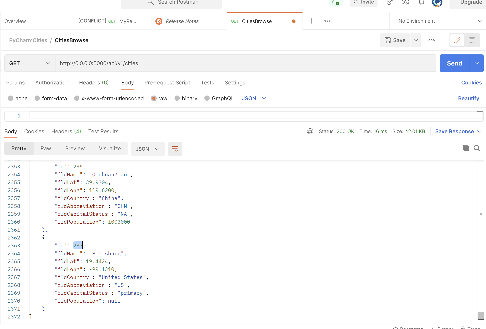
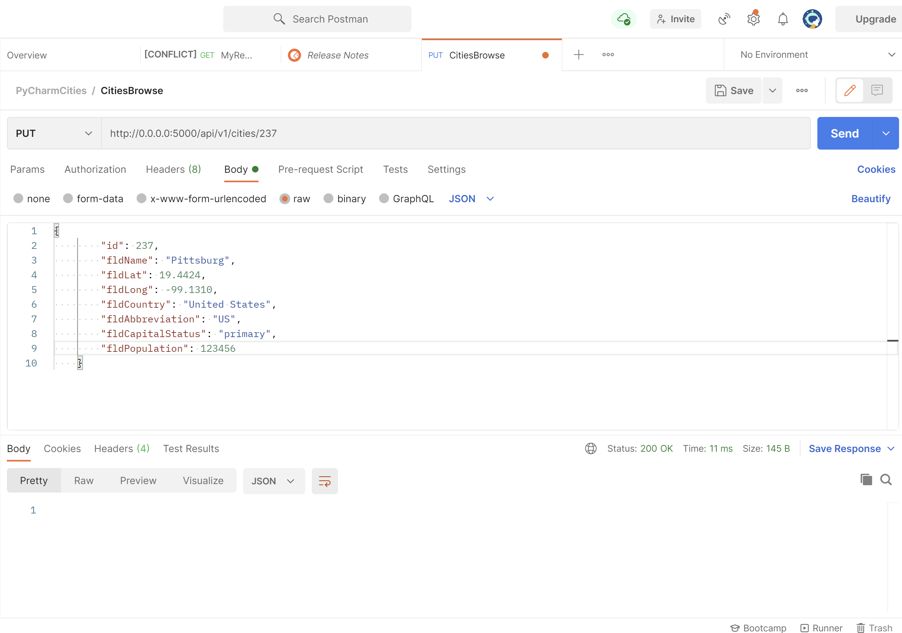
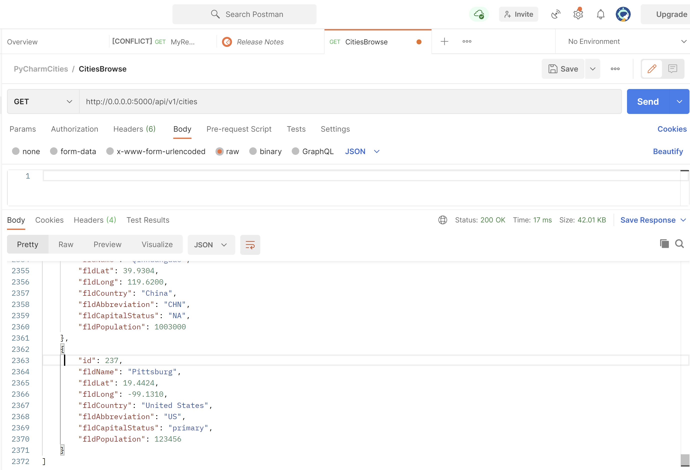
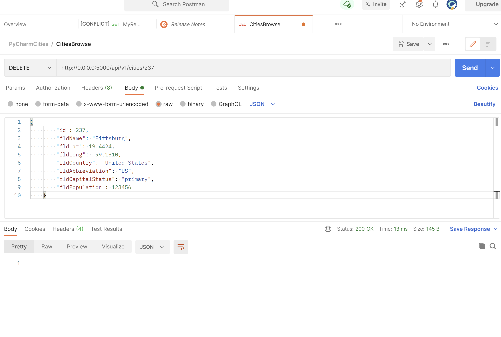
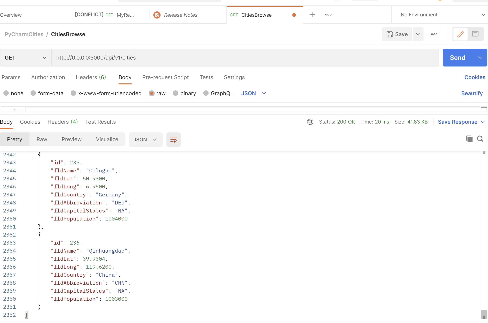

# Project Description
This project is a homework assignment to teach how to get Pycharm setup with Docker, Flask, MySQL, and Postman

## Documents
* [Assignment 4](restIntro-pycharm.pdf)
* [Assignment Document with screenshots](RESTAPIwithFlask-WebApplicationPartFinal.pdf)

## postman screenshots

# Useful Links
* [Flask Homepage and Documentation](https://flask.palletsprojects.com/en/1.1.x/)
* [JSON Spec Reference](https://www.json.org/json-en.html)
* [SimpleJSON Reference](https://simplejson.readthedocs.io/en/latest/)
* [W3 Schools SQL Tutorial and Reference](https://www.w3schools.com/sql/)
